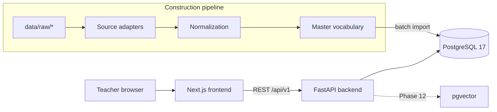
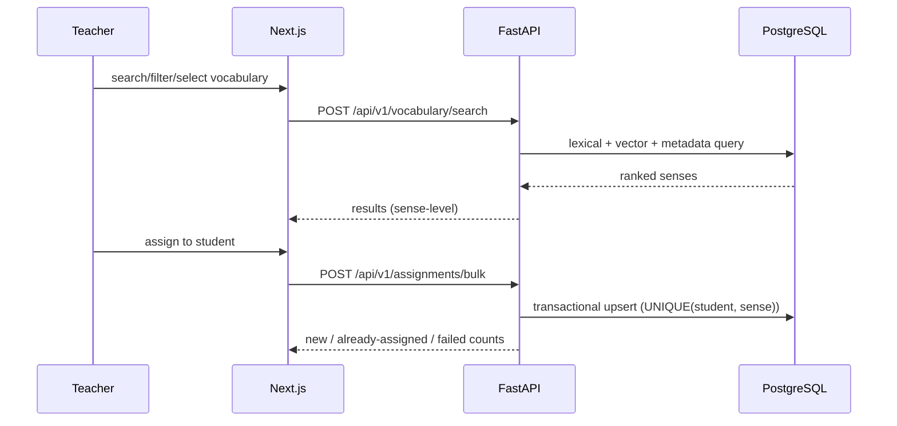

# Architecture

Reflects the implementation as of Phase 0. Updated every phase.

## System Overview



## Frontend Architecture (Phase 0: skeleton)

- Next.js (App Router), TypeScript, Tailwind CSS 4; managed with pnpm.
- Route structure per master_prompt.md section 53 is established in Phase 1.
- Server state: TanStack Query (Phase 16+). No Redux.
- shadcn/ui component library introduced with the first real screens (Phase 16).

## Backend Architecture (Phase 0: skeleton)

```text
backend/
  app/
    main.py          # app factory, lifespan, router mounting
    config.py        # pydantic-settings, env-driven
    api/v1/          # one router per domain (health only, so far)
    db/session.py    # SQLAlchemy 2 engine + session factory (psycopg3)
  tests/             # pytest suite
```

- Sync SQLAlchemy engine (D003) — simple, Alembic-friendly.
- Domain routers are added under `app/api/v1/` in later phases; business
  logic lives in service modules, never in route handlers (section 54).

## Database Architecture

- PostgreSQL 17, native install on this machine (D002); docker-compose.yml
  provides the canonical service definition for Docker-capable environments.
- Database `vocab_platform` created; schema arrives in Phase 2 via Alembic.
- Key constraint preview (Phase 2):
  `UNIQUE(student_id, master_sense_id)` on student vocabulary records.

## ETL Architecture

Not yet implemented. Planned shape (master_prompt.md section 11):

raw sources → source adapters (`pipeline/sources/*.py`) → normalized records
→ sense identity → CEFR/frequency/WordNet/taxonomy/priority → embeddings →
SQLite construction DB → PostgreSQL import. Large files streamed, checkpointed.

## Search Architecture

Not yet implemented (Phase 14). Planned: 4 layers — exact/text (PostgreSQL
full-text), filters, semantic (precomputed BGE-M3 embeddings + pgvector
similarity), deterministic hybrid ranking. Only the teacher's query is
embedded at search time.

## Embedding Architecture

Model BAAI/bge-m3 (locked), 1024-dim, generated during construction,
versioned and checkpointed, stored in pgvector with HNSW index. Requires
D004 (pgvector installation) to be resolved.

## FSRS Architecture

Library-backed FSRS (no SM-2). Teacher ratings HARD/MEDIUM/EASY map to
FSRS Again/Hard/Good. Per-student-per-sense state; every rating appends an
immutable review event (Phase 20–21).

## Authentication

Email + password, Argon2id hashing, HTTP-only session cookie, PostgreSQL
session storage (Phase 15). Students have no credentials.

## Security

Phase 0: secrets via environment (`.env.example` documents all variables;
real `.env` Git-ignored), no secrets in code. Full pass in Phase 24.

## Deployment

Development-only so far. Production deployment documentation is produced in
Phase 28 (sections 65, 101).

## Data Flow


