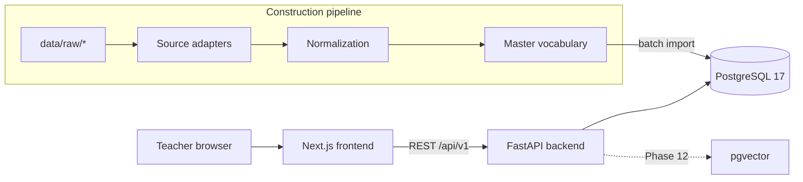
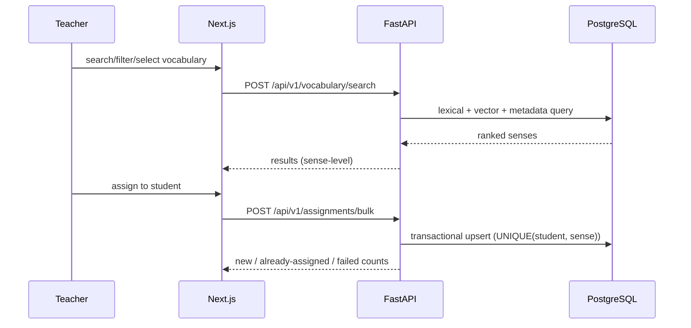

# Architecture

Reflects the implementation as of Phase 11. Updated every phase.

## System Overview



## Frontend Architecture (Phase 1: route structure)

- Next.js (App Router), TypeScript, Tailwind CSS 4; managed with pnpm.
- Route structure per section 53 implemented: /login, /dashboard,
  /vocabulary (+ [senseId]), /students (+ [studentId], /vocabulary, /review),
  /sets (+ [setId]), /settings (+ /shortcuts). Coverage is enforced by
  `frontend/tests/routes.test.ts` against `lib/routes.ts` (single source
  of truth, including which phase implements each route).
- Pages show an honest placeholder (name + planned phase) until their phase
  implements the real UI.
- `lib/api.ts`: typed fetch wrapper; every non-2xx becomes `ApiError`
  carrying the backend envelope (code, message, details, request_id).
- Server state: TanStack Query (Phase 16). No Redux.
- Vocabulary workbench (Phase 16): dense TanStack Table over the search
  API. TanStack Table v9 is used via its official `legacy` v8-compat
  subpath (D018) with server-driven pagination/sorting (§22: filters and
  ordering live in SQL, never client-side on a truncated list).
- Table state (query/mode/sort/filters/page) is URL search params
  (`lib/table-url-state.ts`, pure lossless mappings, unit-tested):
  shareable bookmarkable views, back/forward restore.
- `lib/search-types.ts` / `lib/search-client.ts`: typed models and
  endpoint wrappers mirroring backend/app/api/v1/search.py and
  vocabulary.py.
- Styling is plain Tailwind CSS; no component library yet (shadcn/ui
  deferred until a real screen set justifies the dependency).
- Vitest for unit tests (`pnpm exec vitest run`).

## Backend Architecture (Phase 1: core foundation)

```text
backend/
  app/
    main.py              # app factory: middleware, CORS, handlers, routers
    config.py            # re-export of app.core.settings
    core/
      settings.py        # validated env settings (fails fast at startup)
      context.py         # per-request correlation ID (contextvars)
      logging.py         # JSON/console formats, correlation filter, masking
      errors.py          # AppError hierarchy + error envelope builder
      middleware.py      # CorrelationId + AccessLog middleware
    api/
      exception_handlers.py  # AppError/422/HTTP/500 -> uniform envelope
      v1/                # one router per domain + stub registry
        routers.py       # domain router registry (section 54)
        stub.py          # honest 501 stubs for future-phase endpoints
        health.py        # real health endpoints
        auth|students|vocabulary|search|sets|assignments|reviews|fsrs|imports|exports|admin.py
    db/session.py        # SQLAlchemy 2 engine + session factory (psycopg3)
  tests/                 # pytest suite (27 tests)
```

- Sync SQLAlchemy engine (D003) — simple, Alembic-friendly.
- Domain routers are registered in `app/api/v1/routers.py`; business logic
  will live in service modules, never in route handlers (section 54).
- Every response carries `X-Request-ID`; every error is the uniform envelope
  `{"error": {code, message, details, request_id}}` (D005, section 55).
- Access logs are structured with route/status/duration and the correlation
  ID; sensitive keys are masked before rendering (section 56).

## Database Architecture (Phase 2: core schema)

- PostgreSQL 17, native install on this machine (D002); docker-compose.yml
  provides the canonical service definition for Docker-capable environments.
- Alembic migrations; deterministic constraint names via naming convention.
- 25 tables in three groups:
  - **identity**: teachers, teacher_sessions, students
  - **vocabulary**: vocabulary_senses (root; sense_key UNIQUE),
    vocabulary_forms, sense_definitions, sense_translations, sense_examples,
    vocabulary_sources, sense_source_records, cefr_evidence,
    frequency_evidence, vocabulary_flags, wordnet_synsets,
    wordnet_relations, sense_wordnet_links, categories, sense_categories,
    sense_priorities
  - **learning**: student_vocabulary (UNIQUE(student_id, sense_id) — the
    duplicate-prevention guarantee), student_fsrs_states (due_at indexed),
    review_events (immutable, before/after state), vocabulary_sets,
    vocabulary_set_items, teacher_priority_overrides
- UUID PKs (D006); enums stored as strings; soft deletion via is_active/status.
- Key indexes (section 42): headword_normalized, cefr_level, priority_score,
  part_of_speech, translations (normalized), student+learning_state, due_at,
  review (student, time), set items by sense.
- Evidence tables are UNIQUE per (sense, source): sources never overwrite
  each other (sections 14-15).

## ETL Architecture (Phase 3: inspection complete)

Inspection tooling exists and has profiled all sources
(docs/data-source-inventory.md). Planned shape (master_prompt.md section 11):

raw sources → source adapters (`pipeline/sources/*.py`) → normalized records
→ sense identity → CEFR/frequency/WordNet/taxonomy/priority → embeddings →
SQLite construction DB → PostgreSQL import. Large files streamed, checkpointed.

### PostgreSQL import layer (Phase 13, D015)

`pipeline/storage/pg_import.py` (import-v1) loads the whole construction
payload into PostgreSQL in ONE transaction: roots upserted by `sense_key`
(so sense UUIDs — and therefore `sense_embeddings` FKs — survive
re-imports), child tables delete-refreshed, priorities upserted per
version (history preserved, PK `(sense_id, version)` per migration
c3d94a71b6e2), and `vocabulary_senses.priority_*` refreshed from the
current version (prio-v1.1). All validation uses construction shape
(e.g. duplicate CEFR statements collapse deterministically to the
lowest-(cefr, pos_raw) survivor); every rejected sense, orphan row,
collapsed duplicate and unmapped tag lands in the section-89 report
(`scripts/phase13_import.py` → `data/construction/phase13_import_report.json`),
never silently dropped. Re-import is idempotent (verified: inserted=0,
updated=41,687, UUIDs stable). **Migration tests are sandboxed into
disposable scratch databases — `alembic downgrade` may never target the
development database** (it destroyed data twice before D015).

Measured: the 2.7 GB Wiktextract dump streams at ~12k records/s here (full
pass ≈ 15 min), 10,913,996 lines, 0 malformed. Known schema facts driving
adapter design: Wiktextract translations are word-level (`code: "pl"`),
senses carry glosses + tags; CEFR-J has slash-variant headwords; WordNet
maps lemmas → sense ids → synsets.

### WordNet layer (Phase 8, D010)

`pipeline/enrich/wordnet.py` builds a synset catalog (107,519 synsets,
125,249 relations) stored in the construction DB under WordNet's own ids —
the Phase 13 PostgreSQL import joins the same identifiers into
`wordnet_synsets` / `wordnet_relations` / `sense_wordnet_links`. Relations
are grouped synonym / hypernym / hyponym / related for retrieval and
taxonomy use; the UI is never forced to show raw relation types (§84).
Sense→synset linking (`wnlink-v1.1`) is POS-gated and deterministic:
WordNet's own monosemous assertion (0.80), definition-match via D008 token
rules + a light inflection stemmer (≥ 0.60, ≥ 3-char stem guard), or a
unique ≥ 2 shared-token argmax over definition/members (0.70). Ambiguity
never links — misses are counted, not guessed. Currently 13,263 / 41,690
senses (31.8%) linked on the construction sample; heuristic 0.70 links may
be weighted at retrieval.

### Taxonomy layer (Phase 9, D011)

`pipeline/enrich/taxonomy.py` implements the thematic hierarchy (§18) as a
fixed versioned structure (tax-v1.2 after the D011 audit): 24 top
categories + subcategories (170 nodes) stored as rows shared by the
construction DB, the PostgreSQL import and the UI tree. Classification is
deterministic (§50 — no LLM) with three tiers: corroborated headword
keyword (0.90 — the headword must be confirmed by same-category gloss
evidence, with the headword's own stem excluded, so word-form alone never
assigns a polysemous keyword), WordNet hypernym-chain domain tokens over
Phase 8 links (0.85, bounded depth-5 walk), and multi-keyword gloss stems
(0.70–0.80; single-keyword hits are noise and never assign). Multiple
categories per sense are expected; a sub hit also assigns its parent top;
uncategorized senses are normal (18.5% coverage on the sample — precision
over coverage for teacher-facing filters). Categories are
retrieval/filtering aids only — semantic search must not require them
(§18, §85).

### Priority layer (Phase 10, D012)

`pipeline/enrich/priority.py` scores every sense with a deterministic,
versioned formula (prio-v1.1 after the D012 audit, documented in
docs/priority-scoring.md): `score = (0.35·frequency + 0.15·learner +
0.20·polish + 0.30·quality) × penalty`. Frequency uses an NGSL-tuned rank
curve (never raw rank — §15); CEFR enters as a mild learner-relevance
prior floored at 0.55 so a C2 word is never disqualified (§14); missing
evidence is neutral 0.5, never a penalty (§127); lexical-quality flags
apply a multiplicative penalty (hard ×0.5 — including the slur class
added by the audit —, soft ×0.75 each, floored at 0.25); gloss depth
counts significant tokens (≥ 2 alphanumeric chars). Levels are fixed
quantile-free thresholds (VERY HIGH ≥ 0.70 … VERY LOW < 0.25) — the raw
score is stored but the teacher UI shows levels (§16). Every row keeps its
full component breakdown (`components_json`) and `priority_version`;
`sense_priorities` is keyed (sense_key, version) so new formula versions
add rows and never destroy history (§86). On the construction sample:
VERY HIGH 3,814 / HIGH 17,109 / MEDIUM 11,860 / LOW 5,266 / VERY LOW 3,641
of 41,690 senses.

### Examples & quality layer (Phase 11, D013)

`pipeline/enrich/examples.py` (ex-v1) integrates the two example sources —
Wiktextract sense examples and WordNet synset examples joined through the
Phase 8 links — into the `sense_examples` table (sense_key, position,
text, source): cleaned (whitespace collapse, length 3–300, ≥ 1
alphanumeric), deduplicated casefolded first-wins, wiktextract-then-
wordnet order, capped at 5 per sense; a full refresh, like taxonomy.
`pipeline/enrich/quality.py` (qual-v1) derives the §87 minimum indicators
per sense into `sense_quality`: translation available/confidence (mean
D007), definition available, example available, CEFR available, frequency
available, category confidence (best assignment), and a composite
sense_confidence (0.30 translation + 0.25 definition + 0.20 example +
0.15 CEFR + 0.10 frequency). sense_confidence is an evidence-coverage
view for review queues — deliberately separate from priority (§86), and
missing evidence is 0.0, never invented (§108, §127). Incomplete senses
are retained, never deleted (§87). On the construction sample: 52,824
examples for 25,693 senses, mean sense_confidence 0.5089 over 41,690
senses, 1 zero-evidence sense retained.

## Search Architecture

Implemented (Phase 14, D016; full spec + benchmark in docs/search.md).
One endpoint: POST /api/v1/vocabulary/search.

- Layer 1 — exact/prefix (headword + forms, LIKE) and weighted
  PostgreSQL FTS: generated tsvector columns (A-weighted headword,
  B-weighted definition preview; translations and full definitions
  separate) with GIN indexes, 'simple' dictionary (mixed EN/PL corpus),
  websearch syntax. Polish queries hit translation FTS.
- Layer 2 — filters composed IN SQL on both signal paths (same base
  filter set): CEFR, POS, priority levels/priority_min, category
  subtree (recursive), frequency bands/max rank, flags, student
  assignment/state/due/difficulty/teacher overrides (§22 forbids
  client-side filtering). Filter values enumerable via
  GET /api/v1/vocabulary/search/filters.
- Layer 3 — semantic: teacher's query embedded once (BGE-M3, the corpus
  model); cosine over pgvector HNSW of precomputed emb-v1 vectors; rows
  are never embedded at search time. Cross-lingual (PL↔EN) by design.
- Layer 4 — hybrid: reciprocal-rank fusion, documented deterministic
  blend `0.60·lexical + 0.35·semantic + 0.05·metadata` (+0.25 prefix
  floor); ties break by headword then sense_key; unit-tested (§20).
- Browse semantics: empty query and non-relevance sorts are full-set
  SQL-ordered pages; strict multi-word lexical queries fall back to a
  loose OR-join on zero hits (§21 topic phrases).
- Operational rule: the HNSW index must be REBUILT after bulk embedding
  loads (phase12 script --reindex) — an incrementally-grown graph had
  near-zero recall (diagnosed Phase 14, D016).

## Embedding Architecture

Model BAAI/bge-m3 (locked, D014), 1024-dim, L2-normalized, cosine
similarity. Senses are embedded during construction with recipe emb-v1
`headword | pos | gloss | ex1 | ex2` (max 2 examples; no metadata, §88);
only the teacher's query is embedded at search time. Each row stores
model/version/dims/embedding_version/text_sha256; unchanged senses are
skipped by hash, changed ones re-encoded; checkpoints (last sense_key)
make hours-long CPU runs resumable. Storage is pgvector with an HNSW
cosine index; exactly one embedding_version is kept (embeddings are a
rebuildable derived view, unlike priority history). Generation,
versioning and run instructions: docs/embeddings.md. pgvector 0.8.6
installed and verified on 2026-09-27 (D004 resolved via community
prebuilt for PG 17 — see D004 addendum; production must use a trusted
build).

## FSRS Architecture

Library-backed FSRS (no SM-2). Teacher ratings HARD/MEDIUM/EASY map to
FSRS Again/Hard/Good. Per-student-per-sense state; every rating appends an
immutable review event (Phase 20–21).

## Authentication

Implemented (Phase 15, D017). Email + password with Argon2id hashing
(argon2-cffi defaults). Sessions are fully server-side: the HTTP-only
cookie (`session_token`, SameSite=Lax, Secure in production) carries a
32-byte opaque token whose SHA-256 hash — never the token — is stored
in `teacher_sessions` (24h TTL, instant revocation via `revoked_at`,
lazy pruning of expired rows). `POST /auth/bootstrap` creates the first
teacher and closes forever (403 `bootstrap_closed` afterwards); there
is no public registration. Login is enumeration-safe (uniform 401,
decoy hash for unknown emails). `GET /auth/session` authenticates via
the shared dependency that protected endpoints will reuse (§40).
Students have no credentials.

## Student management (Phase 17)

- Service pattern: domain logic lives in `app/core/students.py`; route
  handlers only authenticate, parse and open a transaction (enforced
  shape for all later domains — D019).
- §40 isolation by scoping: every student query filters
  `teacher_id = session.teacher` in SQL; foreign ids return 404,
  indistinguishable from unknown ids (no enumeration oracle).
- Lifecycle is soft: `status` flips ACTIVE → INACTIVE → DELETED;
  DELETED rows keep `student_vocabulary`, FSRS state and review
  history (§27 forbids destroying learning records).
- Endpoints (all teacher-authenticated): GET/POST `/students`,
  GET/PATCH `/students/{id}`, PATCH `/students/{id}/status`,
  GET `/students/{id}/vocabulary` (assigned senses + learning state
  + FSRS due/repetitions).
- PATCH semantics use Pydantic v2 `model_fields_set`: absent field =
  keep, sent null = clear (D019).

## Assignment (Phase 18)

- One endpoint for single and bulk: `POST /assignments` takes 1..1000
  sense ids for one student and returns the §29 report
  (selected / new / already_assigned / failed); unknown senses are
  reported per-item, never a wholesale failure (D020).
- Duplicate prevention is layered (§29): the service pre-checks
  existing assignments, reactivates inactive records instead of
  duplicating, and the DB `UNIQUE(student_id, sense_id)` constraint is
  the mandatory backstop (row-count-tested).
- `PATCH /assignments/{assignment_id}` applies explicit §31 teacher
  overrides only to fields actually sent (learning_state,
  per-student teacher_priority_override, is_active); assignments are
  scoped through the owning student (§40 404s).
- §30 not-assigned workflow: `assigned`/`student_id` predicates live in
  the search engine (anti-join over student_vocabulary) and are exposed
  on both POST /vocabulary/search and the GET browse wrapper.

## FSRS scheduling & reviews (Phase 20)

- Library-backed py-fsrs 6.3.2 (FSRS-6), deterministic: fuzzing off,
  learning/relearning steps empty (§31 documented transitions, D022).
- The exact card persists as `student_fsrs_states.state_json`
  (migration b8e5d1f2a3c4); stability/difficulty/reps/lapses are
  denormalized for the due-queue scan and dashboards.
- Rating mapping (§6): HARD→Again(1), MEDIUM→Hard(2), EASY→Good(3);
  exposed at GET /fsrs/parameters.
- Learning-state derivation is outcome-based (last rating + repetition
  count), documented in D022; MASTERED is a teacher override only.
- Every review appends an immutable review_events row (§33) with
  previous/new card JSON and due dates; reps/lapses derive from this
  history, never overwritten.
- Endpoints (teacher-authenticated): GET /reviews/due (overdue → due
  today → new), POST /reviews, GET /fsrs/parameters.

## Import/export (Phase 22)

- Master-vocabulary files only (§38/§99, D024): a stable 10-column
  schema (sense_key, headword, POS, CEFR, definition, priority level,
  frequency rank, translations_pl, examples, flags). Student learning
  data never exports; student-viewpoint filters are forbidden on the
  export model (extra=forbid → 422).
- Export: POST /exports/vocabulary (teacher-only) returns file
  downloads (CSV / XLSX / JSON). Selection reuses the Phase 14
  engine's `_apply_filters`, so an export equals the filtered
  workbench view; deterministic ordering; 50k-row cap; XLSX streams
  via openpyxl write-only mode.
- Import: two-step — POST /imports/vocabulary/preview (parse +
  validate + classify; zero writes) then POST /imports/vocabulary
  (re-validate + commit in one transaction). CSV (RFC-4180, BOM
  tolerated), XLSX (first sheet), JSON (array); 10k-row cap;
  multipart via python-multipart.
- §99 safeguards: insert-only (senses INSERT; translations, examples
  and flags APPEND deduped; no UPDATE/DELETE anywhere in the import
  path). Rows whose master fields differ from the stored sense are
  skipped and reported as conflicts. Structurally invalid rows abort
  the request with 422 and a per-row report — zero partial writes.
- Identity is the sense_key round-trip (D008): exported keys reattach;
  keyless rows derive keys with the exact Phase 6 chain
  (make_sense_key ∘ search_key ∘ canonical_pos ∘ clean_gloss), so
  export → wipe → re-import reproduces the same identity.
- Frontend: an "Export / import" panel on the vocabulary workbench —
  Blob download honoring current filters; file upload → Validate
  (per-row status) → explicit Import button.

## Dashboard (Phase 21)

- Two read models over one SQL definition set (§36/§98, D023), both
  read-only and teacher-scoped (§40):
  - `GET /students/{id}/dashboard` — the §36 per-student payload:
    counts (assigned/learning/reviewing/mastered/due/overdue, reusing
    the Phase 20 definitions), `next_up` (first row of the §32 queue),
    `difficult` (most HARD ratings over 30 days, top 5),
    `recent_reviews` (latest §33 events).
  - `GET /dashboard` — the §98 roster rollup: one count row per
    student + totals, ordered by attention need (overdue → due →
    name). DELETED students never appear; INACTIVE only with
    `include_inactive=true` (matching GET /students).
- `next_up` shares the review queue's bucketed SQL: the Phase 20
  queue SQL lives in `app/core/reviews.py::_due_rows` (no auth checks;
  callers pre-scope), so the dashboard's primary answer can never
  disagree with what GET /reviews/due returns first.
- Service logic in `app/core/dashboard.py`; routes are the students
  router plus a small dedicated `dashboard` router. No BI features —
  no charts, trends, or drill-downs (§36 "practical, not
  analytics-heavy").
- Frontend: `/dashboard` roster page (totals chips, per-student counts,
  overdue highlighted, Review shortcut) and a per-student "Review
  dashboard" panel on the profile (counts, next-up card, difficult
  list, recent reviews).

## Vocabulary sets (Phase 19)

- Sets are references only: `vocabulary_set_items` has
  (set_id, sense_id) as its primary key; no sense data is copied (§26
  "does NOT create duplicate vocabulary" — D021).
- Endpoints (teacher-authenticated, WHERE-scoped per §40): GET/POST
  `/sets`, GET/PATCH/DELETE `/sets/{id}`, POST/DELETE `/sets/{id}/items`,
  POST `/sets/{id}/assign`. Per-teacher name uniqueness (409).
- Membership edits use the §29 accounting shape (selected / new /
  already_in_set / failed); the (set_id, sense_id) PK is the backstop.
- Assign-set composes the Phase 18 assignment service — one duplicate-
  prevention implementation for both flows.

## Vocabulary read APIs (Phase 16)

- `GET /api/v1/vocabulary` — filtered browse; a thin GET wrapper over
  the same Phase 14 engine as `POST /vocabulary/search` (identical
  coercion, filter composition, sorting, pagination; parity-tested,
  D018). Source for the workbench table's query-less views.
- `GET /api/v1/vocabulary/{sense_id}` — complete one-sense payload:
  forms, definitions, Polish translations, examples, categories,
  per-source frequency evidence and all priority versions; 404
  envelope for unknown/invalid ids.
- `GET /api/v1/vocabulary/search/filters` — facet enumeration that
  drives the filter sidebar (unchanged since Phase 14).

## Security

Secrets via environment (`.env.example` documents all variables; real `.env`
Git-ignored), no secrets in code. Error responses never leak stack traces,
paths or internals (enforced by handlers + tests). CORS restricted to the
configured browser origins; credentials allowed for future session cookies.
Full hardening pass in Phase 24.

## Deployment

Development-only so far. Production deployment documentation is produced in
Phase 28 (sections 65, 101).

## Data Flow


