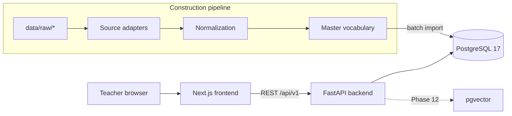
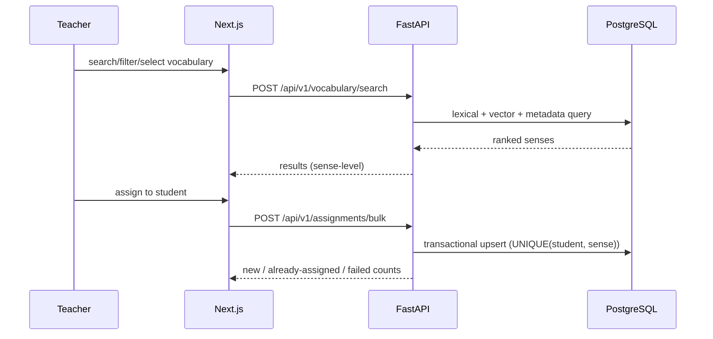

# Architecture

Reflects the implementation as of Phase 11. Updated every phase.

## System Overview



## Frontend Architecture (Phase 1: route structure)

- Next.js (App Router), TypeScript, Tailwind CSS 4; managed with pnpm.
- Route structure per section 53 implemented: /login, /dashboard,
  /vocabulary (+ [senseId]), /students (+ [studentId], /vocabulary, /review),
  /sets (+ [setId]), /settings (+ /shortcuts). Coverage is enforced by
  `frontend/tests/routes.test.ts` against `lib/routes.ts` (single source
  of truth, including which phase implements each route).
- Pages show an honest placeholder (name + planned phase) until their phase
  implements the real UI.
- `lib/api.ts`: typed fetch wrapper; every non-2xx becomes `ApiError`
  carrying the backend envelope (code, message, details, request_id).
- Server state: TanStack Query from Phase 16. No Redux.
- shadcn/ui component library introduced with the first real screens (Phase 16).
- Vitest for unit tests (`pnpm exec vitest run`).

## Backend Architecture (Phase 1: core foundation)

```text
backend/
  app/
    main.py              # app factory: middleware, CORS, handlers, routers
    config.py            # re-export of app.core.settings
    core/
      settings.py        # validated env settings (fails fast at startup)
      context.py         # per-request correlation ID (contextvars)
      logging.py         # JSON/console formats, correlation filter, masking
      errors.py          # AppError hierarchy + error envelope builder
      middleware.py      # CorrelationId + AccessLog middleware
    api/
      exception_handlers.py  # AppError/422/HTTP/500 -> uniform envelope
      v1/                # one router per domain + stub registry
        routers.py       # domain router registry (section 54)
        stub.py          # honest 501 stubs for future-phase endpoints
        health.py        # real health endpoints
        auth|students|vocabulary|search|sets|assignments|reviews|fsrs|imports|exports|admin.py
    db/session.py        # SQLAlchemy 2 engine + session factory (psycopg3)
  tests/                 # pytest suite (27 tests)
```

- Sync SQLAlchemy engine (D003) — simple, Alembic-friendly.
- Domain routers are registered in `app/api/v1/routers.py`; business logic
  will live in service modules, never in route handlers (section 54).
- Every response carries `X-Request-ID`; every error is the uniform envelope
  `{"error": {code, message, details, request_id}}` (D005, section 55).
- Access logs are structured with route/status/duration and the correlation
  ID; sensitive keys are masked before rendering (section 56).

## Database Architecture (Phase 2: core schema)

- PostgreSQL 17, native install on this machine (D002); docker-compose.yml
  provides the canonical service definition for Docker-capable environments.
- Alembic migrations; deterministic constraint names via naming convention.
- 25 tables in three groups:
  - **identity**: teachers, teacher_sessions, students
  - **vocabulary**: vocabulary_senses (root; sense_key UNIQUE),
    vocabulary_forms, sense_definitions, sense_translations, sense_examples,
    vocabulary_sources, sense_source_records, cefr_evidence,
    frequency_evidence, vocabulary_flags, wordnet_synsets,
    wordnet_relations, sense_wordnet_links, categories, sense_categories,
    sense_priorities
  - **learning**: student_vocabulary (UNIQUE(student_id, sense_id) — the
    duplicate-prevention guarantee), student_fsrs_states (due_at indexed),
    review_events (immutable, before/after state), vocabulary_sets,
    vocabulary_set_items, teacher_priority_overrides
- UUID PKs (D006); enums stored as strings; soft deletion via is_active/status.
- Key indexes (section 42): headword_normalized, cefr_level, priority_score,
  part_of_speech, translations (normalized), student+learning_state, due_at,
  review (student, time), set items by sense.
- Evidence tables are UNIQUE per (sense, source): sources never overwrite
  each other (sections 14-15).

## ETL Architecture (Phase 3: inspection complete)

Inspection tooling exists and has profiled all sources
(docs/data-source-inventory.md). Planned shape (master_prompt.md section 11):

raw sources → source adapters (`pipeline/sources/*.py`) → normalized records
→ sense identity → CEFR/frequency/WordNet/taxonomy/priority → embeddings →
SQLite construction DB → PostgreSQL import. Large files streamed, checkpointed.

Measured: the 2.7 GB Wiktextract dump streams at ~12k records/s here (full
pass ≈ 15 min), 10,913,996 lines, 0 malformed. Known schema facts driving
adapter design: Wiktextract translations are word-level (`code: "pl"`),
senses carry glosses + tags; CEFR-J has slash-variant headwords; WordNet
maps lemmas → sense ids → synsets.

### WordNet layer (Phase 8, D010)

`pipeline/enrich/wordnet.py` builds a synset catalog (107,519 synsets,
125,249 relations) stored in the construction DB under WordNet's own ids —
the Phase 13 PostgreSQL import joins the same identifiers into
`wordnet_synsets` / `wordnet_relations` / `sense_wordnet_links`. Relations
are grouped synonym / hypernym / hyponym / related for retrieval and
taxonomy use; the UI is never forced to show raw relation types (§84).
Sense→synset linking (`wnlink-v1.1`) is POS-gated and deterministic:
WordNet's own monosemous assertion (0.80), definition-match via D008 token
rules + a light inflection stemmer (≥ 0.60, ≥ 3-char stem guard), or a
unique ≥ 2 shared-token argmax over definition/members (0.70). Ambiguity
never links — misses are counted, not guessed. Currently 13,263 / 41,690
senses (31.8%) linked on the construction sample; heuristic 0.70 links may
be weighted at retrieval.

### Taxonomy layer (Phase 9, D011)

`pipeline/enrich/taxonomy.py` implements the thematic hierarchy (§18) as a
fixed versioned structure (tax-v1.2 after the D011 audit): 24 top
categories + subcategories (170 nodes) stored as rows shared by the
construction DB, the PostgreSQL import and the UI tree. Classification is
deterministic (§50 — no LLM) with three tiers: corroborated headword
keyword (0.90 — the headword must be confirmed by same-category gloss
evidence, with the headword's own stem excluded, so word-form alone never
assigns a polysemous keyword), WordNet hypernym-chain domain tokens over
Phase 8 links (0.85, bounded depth-5 walk), and multi-keyword gloss stems
(0.70–0.80; single-keyword hits are noise and never assign). Multiple
categories per sense are expected; a sub hit also assigns its parent top;
uncategorized senses are normal (18.5% coverage on the sample — precision
over coverage for teacher-facing filters). Categories are
retrieval/filtering aids only — semantic search must not require them
(§18, §85).

### Priority layer (Phase 10, D012)

`pipeline/enrich/priority.py` scores every sense with a deterministic,
versioned formula (prio-v1.1 after the D012 audit, documented in
docs/priority-scoring.md): `score = (0.35·frequency + 0.15·learner +
0.20·polish + 0.30·quality) × penalty`. Frequency uses an NGSL-tuned rank
curve (never raw rank — §15); CEFR enters as a mild learner-relevance
prior floored at 0.55 so a C2 word is never disqualified (§14); missing
evidence is neutral 0.5, never a penalty (§127); lexical-quality flags
apply a multiplicative penalty (hard ×0.5 — including the slur class
added by the audit —, soft ×0.75 each, floored at 0.25); gloss depth
counts significant tokens (≥ 2 alphanumeric chars). Levels are fixed
quantile-free thresholds (VERY HIGH ≥ 0.70 … VERY LOW < 0.25) — the raw
score is stored but the teacher UI shows levels (§16). Every row keeps its
full component breakdown (`components_json`) and `priority_version`;
`sense_priorities` is keyed (sense_key, version) so new formula versions
add rows and never destroy history (§86). On the construction sample:
VERY HIGH 3,814 / HIGH 17,109 / MEDIUM 11,860 / LOW 5,266 / VERY LOW 3,641
of 41,690 senses.

### Examples & quality layer (Phase 11, D013)

`pipeline/enrich/examples.py` (ex-v1) integrates the two example sources —
Wiktextract sense examples and WordNet synset examples joined through the
Phase 8 links — into the `sense_examples` table (sense_key, position,
text, source): cleaned (whitespace collapse, length 3–300, ≥ 1
alphanumeric), deduplicated casefolded first-wins, wiktextract-then-
wordnet order, capped at 5 per sense; a full refresh, like taxonomy.
`pipeline/enrich/quality.py` (qual-v1) derives the §87 minimum indicators
per sense into `sense_quality`: translation available/confidence (mean
D007), definition available, example available, CEFR available, frequency
available, category confidence (best assignment), and a composite
sense_confidence (0.30 translation + 0.25 definition + 0.20 example +
0.15 CEFR + 0.10 frequency). sense_confidence is an evidence-coverage
view for review queues — deliberately separate from priority (§86), and
missing evidence is 0.0, never invented (§108, §127). Incomplete senses
are retained, never deleted (§87). On the construction sample: 52,824
examples for 25,693 senses, mean sense_confidence 0.5089 over 41,690
senses, 1 zero-evidence sense retained.

## Search Architecture

Not yet implemented (Phase 14). Planned: 4 layers — exact/text (PostgreSQL
full-text), filters, semantic (precomputed BGE-M3 embeddings + pgvector
similarity), deterministic hybrid ranking. Only the teacher's query is
embedded at search time.

## Embedding Architecture

Model BAAI/bge-m3 (locked), 1024-dim, generated during construction,
versioned and checkpointed, stored in pgvector with HNSW index. pgvector
0.8.6 installed and verified on 2026-09-27 (D004 resolved via community
prebuilt for PG 17 — see D004 addendum; production must use a trusted
build).

## FSRS Architecture

Library-backed FSRS (no SM-2). Teacher ratings HARD/MEDIUM/EASY map to
FSRS Again/Hard/Good. Per-student-per-sense state; every rating appends an
immutable review event (Phase 20–21).

## Authentication

Email + password, Argon2id hashing, HTTP-only session cookie, PostgreSQL
session storage (Phase 15). Students have no credentials.

## Security

Secrets via environment (`.env.example` documents all variables; real `.env`
Git-ignored), no secrets in code. Error responses never leak stack traces,
paths or internals (enforced by handlers + tests). CORS restricted to the
configured browser origins; credentials allowed for future session cookies.
Full hardening pass in Phase 24.

## Deployment

Development-only so far. Production deployment documentation is produced in
Phase 28 (sections 65, 101).

## Data Flow


